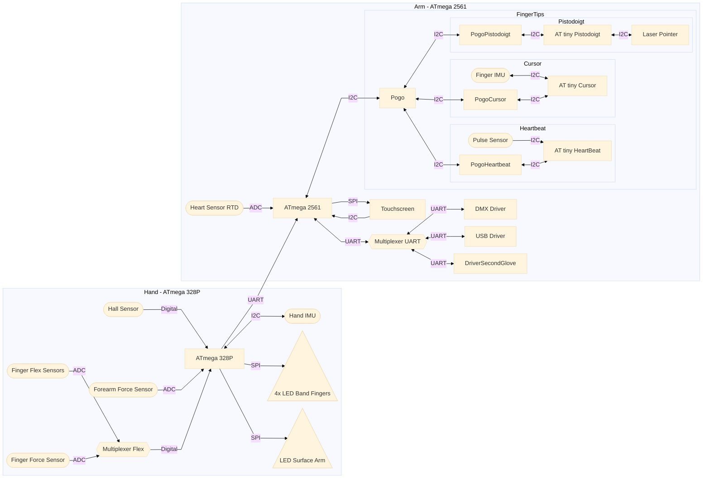

```mermaid
%%{init:
	{'flowchart':
		{
			'curve': 'linear',
			'nodeSpacing':20,
			'rankSpacing': 20,
			'diagramMarginX': 50,
			'diagramMarginY': 50,
			'htmlLabels': true,
			'useMaxWidth': true
		},
		'theme': 'base',
		'primaryColor': '#ffffff'
	}
}%%
graph LR

	%% Hand Subsystem
	subgraph Hand["Hand - ATmega 328P"]
		direction LR
		%% Input sensors (left side)
		HandIMU@{ shape: stadium, label: "Hand IMU" }
		HandHallCaptor@{ shape: stadium, label: "Hall Sensor" }
		FingerFlexSensors@{ shape: stadium, label: "Finger Flex Sensors" }
		FingerForceResistanceSensor@{ shape: stadium, label: "Finger Force Sensor" }
		ForearmForceResistanceSensor@{ shape: stadium, label: "Forearm Force Sensor" }
		MultiplexerFlex@{ shape: hex, label: "Multiplexer Flex" }

		%% Central processor
		MicrochipHand@{ shape: rect, label: "ATmega 328P" }

		%% Output components (right side)
		LedDoigts5@{ shape: triangle, label: "4x LED Band Fingers" }
		LedBras@{ shape: triangle, label: "LED Surface Arm" }

		MicrochipHand <-->|I2C| HandIMU
		HandHallCaptor -->|Digital| MicrochipHand
		FingerFlexSensors -->|ADC| MultiplexerFlex
		FingerForceResistanceSensor -->|ADC| MultiplexerFlex
		ForearmForceResistanceSensor -->|ADC| MicrochipHand
		MultiplexerFlex -->|Digital| MicrochipHand
		MicrochipHand -->|SPI| LedDoigts5
		MicrochipHand -->|SPI| LedBras
	end

	%% Arm Subsystem
	subgraph Arm["Arm - ATmega 2561"]
		direction RL

		%% Central processor
		MicrochipArm@{ shape: rect, label: "ATmega 2561" }

		%% FINGERTIPS (modular addons)
		subgraph FingerTips
			direction LR
			PogoReception@{ shape:hex, label: "Pogo"}

			subgraph FingertipHeartbeat["Heartbeat"]
				direction TB
				ATtinyHeartBeat@{ label: "AT tiny HeartBeat"}
				PulseSensor@{ shape: stadium, label: "Pulse Sensor" }
				PulseSensor -->|I2C| ATtinyHeartBeat
				PogoHeartbeat <-->|I2C| ATtinyHeartBeat
			end

			subgraph FingertipCursor["Cursor"]
				direction LR
				ATtinyCursor@{ label: "AT tiny Cursor"}
				FingerIMU@{ shape: stadium, label: "Finger IMU" }
				FingerIMU <-->|I2C| ATtinyCursor
				PogoCursor <-->|I2C| ATtinyCursor
			end

			subgraph FingertipGun["Pistodoigt"]
				ATtinyPistodoigt@{ label: "AT tiny Pistodoigt"}
				LaserPointer@{ shape: rect, label: "Laser Pointer" }
				ATtinyPistodoigt <-->|I2C| LaserPointer
				PogoPistodoigt <-->|I2C| ATtinyPistodoigt
			end

		end

		%% Input sensors (left side)
		HeartSensorRTD@{ shape: stadium, label: "Heart Sensor RTD" }

		%% Output/Interface components (right side)
		Touchscreen@{ shape: rect, label: "Touchscreen" }
		MultiplexerUart@{ shape: hex, label: "Multiplexer UART" }

		DriverDMX@{ shape: rect, label: "DMX Driver" }
		DriverUSB@{ shape: rect, label: "USB Driver" }

		MicrochipArm <-->|I2C| PogoReception

		PogoReception <-->|I2C| PogoHeartbeat
		PogoReception <-->|I2C| PogoCursor
		PogoReception <-->|I2C| PogoPistodoigt

		MicrochipArm -->|SPI| Touchscreen
		Touchscreen -->|I2C| MicrochipArm

		MicrochipArm <-->|UART| MultiplexerUart
		MultiplexerUart <-->|UART| DriverDMX
		MultiplexerUart <-->|UART| DriverUSB
		MultiplexerUart <-->|UART| DriverSecondGlove

		HeartSensorRTD -->|ADC| MicrochipArm
	end

	%% Inter-subsystem Connection
	MicrochipHand -->|UART| MicrochipArm

	%% Styling for Connection Types
	classDef i2c stroke:#0066cc,stroke-width:2px,color:#000
	classDef uart stroke:#ff6600,stroke-width:2px,color:#000
	classDef digital stroke:#00aa00,stroke-width:2px,color:#000
	classDef adc stroke:#9933ff,stroke-width:2px,color:#000
	classDef sensor padding:2px,font-size:11px,rx:10px,ry:10px
```
