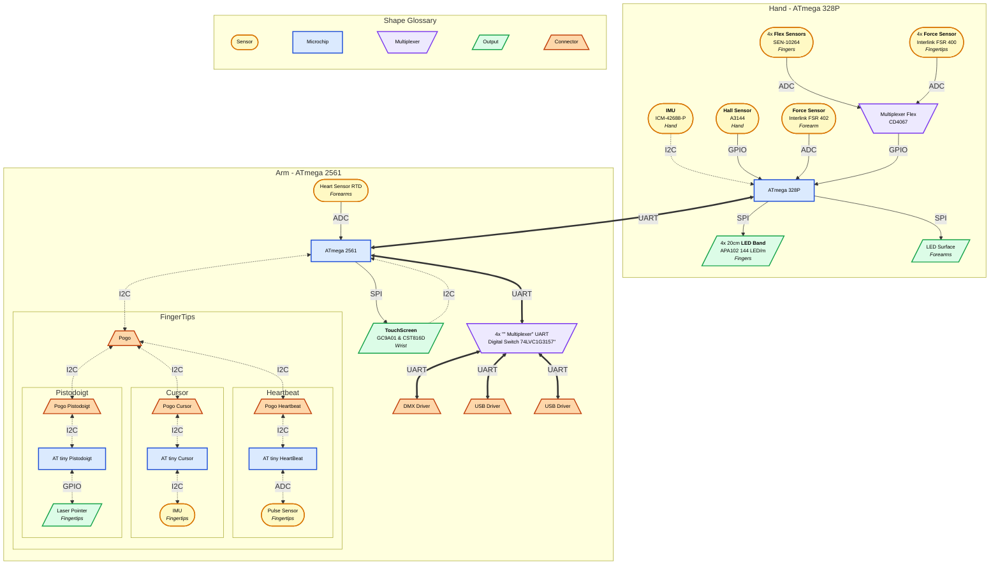

```mermaid
%%{init:
	{'flowchart':
		{
			'curve': 'basis',
			'nodeSpacing':50,
			'rankSpacing': 20,
			'htmlLabels': true,
			'useMaxWidth': true,
		},
		'theme': 'base'
	}
}%%

graph

	subgraph Hand["Hand - ATmega 328P"]

		%% Input
		HandIMU@{ shape: stadium, label: "<b>IMU</b><br>ICM-42688-P<br><i>Hand</i>" }
		HandHallCaptor@{ shape: stadium, label: "<b>Hall Sensor</b><br>A3144<br><i>Hand</i>" }
		ForearmForceResistanceSensor@{ shape: stadium, label: "<b>Force Sensor</b><br>Interlink FSR 402<br><i>Forearm</i>" }
		MultiplexerFlex@{ shape: inv-trapezoid, label: "Multiplexer Flex<br>CD4067" }
		FingerFlexSensors@{ shape: stadium, label: "4x <b>Flex Sensors</b><br>SEN-10264<br><i>Fingers</i>" }
		FingerForceResistanceSensor@{ shape: stadium, label: "4x <b>Force Sensor</b><br>Interlink FSR 400<br><i>Fingertips</i>" }

		%% Output
		LedDoigts5@{ shape: lean-right, label: "4x 20cm <b>LED Band</b><br>APA102 144 LED/m<br><i>Fingers</i>" }
		LedBras@{ shape: lean-right, label: "LED Surface<br><i>Forearms</i>" }

		%% Central
		MicrochipHand@{ shape: rect, label: "ATmega 328P" }

	end

	subgraph Arm["Arm - ATmega 2561"]

		%% Input
		HeartSensorRTD@{ shape: stadium, label: "Heart Sensor RTD<br><i>Forearms</i>" }

		%% FINGERTIPS (modular addons)
		subgraph FingerTips

			PogoReception@{ shape: trapezoid, label: "Pogo"}

			subgraph FingertipHeartbeat["Heartbeat"]
				ATtinyHeartBeat@{ label: "AT tiny HeartBeat"}
				PulseSensor@{ shape: stadium, label: "Pulse Sensor<br><i>Fingertips</i>" }
				PogoHeartbeat@{ shape: trapezoid, label: "Pogo Heartbeat"}
			end

			subgraph FingertipCursor["Cursor"]
				ATtinyCursor@{ label: "AT tiny Cursor"}
				FingerIMU@{ shape: stadium, label: "IMU<br><i>Fingertips</i>" }
				PogoCursor@{ shape: trapezoid, label: "Pogo Cursor"}
			end

			subgraph FingertipGun["Pistodoigt"]
				ATtinyPistodoigt@{ label: "AT tiny Pistodoigt"}
				LaserPointer@{ shape: lean-right, label: "Laser Pointer<br><i>Fingertips</i>" }
				PogoPistodoigt@{ shape: trapezoid, label: "Pogo Pistodoigt"}
			end

		end

		%% Output
		Touchscreen@{ shape: lean-right, label: "<b> TouchScreen </b> <br>GC9A01 & CST816D <br><i>Wrist</i>" }
		MultiplexerUart@{ shape: inv-trapezoid, label: 4x "\" Multiplexer\" UART<br>Digital Switch 74LVC1G3157" }
			DriverDMX@{ shape: trapezoid, label: "DMX Driver" }
			DriverUSB@{ shape: trapezoid, label: "USB Driver" }
			DriverSecondGlove@{ shape: trapezoid, label: "USB Driver" }

		%% Central processor
		MicrochipArm@{ shape: rect, label: "ATmega 2561" }

	end

	subgraph Glossary["Shape Glossary"]
		G_Sensor@{ shape: stadium, label: "Sensor" }
		G_Chip@{ shape: rect, label: "Microchip" }
		G_Mux@{ shape: inv-trapezoid, label: "Multiplexer" }
		G_Out@{ shape: lean-right, label: "Output" }
		G_Conn@{ shape: trapezoid, label: "Connector" }
		G_Sensor ~~~ G_Chip ~~~ G_Mux ~~~ G_Out ~~~ G_Conn
	end

	HandIMU -.-> |I2C| MicrochipHand
	HandHallCaptor -->|GPIO| MicrochipHand
	ForearmForceResistanceSensor -->|ADC| MicrochipHand

	MultiplexerFlex -->|GPIO| MicrochipHand
	FingerFlexSensors -->|ADC| MultiplexerFlex
	FingerForceResistanceSensor -->|ADC| MultiplexerFlex

	MicrochipHand -->|SPI| LedDoigts5
	MicrochipHand -->|SPI| LedBras

	HeartSensorRTD -->|ADC| MicrochipArm

	MicrochipHand <==>|UART| MicrochipArm
	%% MicrochipHand ~~~ MicrochipArm

	MicrochipArm <==>|UART| MultiplexerUart
	MultiplexerUart <==>|UART| DriverDMX
	MultiplexerUart <==>|UART| DriverUSB
	MultiplexerUart <==>|UART| DriverSecondGlove

	MicrochipArm <-.->|I2C| PogoReception

	PogoReception <-.->|I2C| PogoHeartbeat
	PogoHeartbeat <-.->|I2C| ATtinyHeartBeat
	ATtinyHeartBeat <-.->|ADC| PulseSensor

	PogoReception <-.->|I2C| PogoCursor
	PogoCursor <-.->|I2C| ATtinyCursor
	ATtinyCursor <-.->|I2C| FingerIMU

	PogoReception <-.->|I2C| PogoPistodoigt
	PogoPistodoigt <-.->|I2C| ATtinyPistodoigt
	ATtinyPistodoigt <-.->|GPIO| LaserPointer

	MicrochipArm -->|SPI| Touchscreen
	Touchscreen -.->|I2C| MicrochipArm

	%% Style

	classDef sensor padding:0px,font-size:11px,fill:#FFF9C4,stroke:#D97706,stroke-width:2px,color:#000
	classDef chip padding:0px,font-size:11px,fill:#DBEAFE,stroke:#1D4ED8,stroke-width:2px,color:#000
	classDef multiplexer padding:0px,font-size:11px,fill:#EDE9FE,stroke:#7C3AED,stroke-width:2px,color:#000
	classDef led padding:0px,font-size:11px,fill:#DCFCE7,stroke:#16A34A,stroke-width:2px,color:#000
	classDef connector padding:0px,font-size:11px,fill:#FED7AA,stroke:#C2410C,stroke-width:2px,color:#000

	class HandIMU,HandHallCaptor,FingerFlexSensors,FingerForceResistanceSensor,ForearmForceResistanceSensor,PulseSensor,FingerIMU,HeartSensorRTD sensor
	class MicrochipHand,MicrochipArm,ATtinyHeartBeat,ATtinyCursor,ATtinyPistodoigt chip
	class MultiplexerFlex,MultiplexerUart multiplexer
	class LedDoigts5,LedBras,LaserPointer,Touchscreen led
	class PogoReception,PogoHeartbeat,PogoCursor,PogoPistodoigt,DriverDMX,DriverUSB,DriverSecondGlove connector

	class G_Sensor sensor
	class G_Chip chip
	class G_Mux multiplexer
	class G_Out led
	class G_Driv driver
	class G_Conn connector

```
