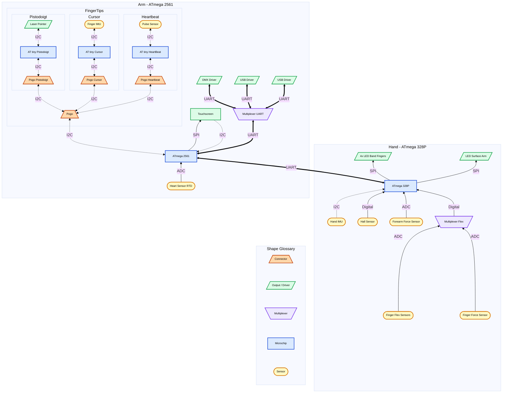

```mermaid
%%{init:
	{'graph':
		{
			'curve': 'basis',
			'nodeSpacing':50,
			'rankSpacing': 20,
			'diagramMarginX': 50,
			'diagramMarginY': 50,
			'htmlLabels': true,
			'useMaxWidth': true
		},
		'theme': 'base'
	}
}%%

graph BT

	subgraph Hand["Hand - ATmega 328P"]
		direction BT

		%% Input
		HandIMU@{ shape: stadium, label: "Hand IMU" }
		HandHallCaptor@{ shape: stadium, label: "Hall Sensor" }
		ForearmForceResistanceSensor@{ shape: stadium, label: "Forearm Force Sensor" }
		MultiplexerFlex@{ shape: inv-trapezoid, label: "Multiplexer Flex" }
		FingerFlexSensors@{ shape: stadium, label: "Finger Flex Sensors" }
		FingerForceResistanceSensor@{ shape: stadium, label: "Finger Force Sensor" }

		%% Output
		LedDoigts5@{ shape: lean-right, label: "4x LED Band Fingers" }
		LedBras@{ shape: lean-right, label: "LED Surface Arm" }

		%% Central
		MicrochipHand@{ shape: rect, label: "ATmega 328P" }

	end

	subgraph Arm["Arm - ATmega 2561"]
		direction BT

		%% Input
		HeartSensorRTD@{ shape: stadium, label: "Heart Sensor RTD" }

		%% FINGERTIPS (modular addons)
		subgraph FingerTips
			direction TB
			PogoReception@{ shape: trapezoid, label: "Pogo"}

			subgraph FingertipHeartbeat["Heartbeat"]
				direction TB
				ATtinyHeartBeat@{ label: "AT tiny HeartBeat"}
				PulseSensor@{ shape: stadium, label: "Pulse Sensor" }
				PogoHeartbeat@{ shape: trapezoid, label: "Pogo Heartbeat"}
			end

			subgraph FingertipCursor["Cursor"]
				direction TB
				ATtinyCursor@{ label: "AT tiny Cursor"}
				FingerIMU@{ shape: stadium, label: "Finger IMU" }
				PogoCursor@{ shape: trapezoid, label: "Pogo Cursor"}
			end

			subgraph FingertipGun["Pistodoigt"]
				ATtinyPistodoigt@{ label: "AT tiny Pistodoigt"}
				LaserPointer@{ shape: lean-right, label: "Laser Pointer" }
				PogoPistodoigt@{ shape: trapezoid, label: "Pogo Pistodoigt"}
			end

		end

		%% Output
		Touchscreen@{ shape: rect, label: "Touchscreen" }
		MultiplexerUart@{ shape: inv-trapezoid, label: "Multiplexer UART" }
			DriverDMX@{ shape: lean-right, label: "DMX Driver" }
			DriverUSB@{ shape: lean-right, label: "USB Driver" }
			DriverSecondGlove@{ shape: lean-right, label: "USB Driver" }

		%% Central processor
		MicrochipArm@{ shape: rect, label: "ATmega 2561" }

	end

	subgraph Glossary["Shape Glossary"]
		direction BT
		G_Sensor@{ shape: stadium, label: "Sensor" }
		G_Chip@{ shape: rect, label: "Microchip" }
		G_Mux@{ shape: inv-trapezoid, label: "Multiplexer" }
		G_Out@{ shape: lean-right, label: "Output / Driver" }
		G_Conn@{ shape: trapezoid, label: "Connector" }
		G_Sensor ~~~ G_Chip ~~~ G_Mux ~~~ G_Out ~~~ G_Conn
	end

	HandIMU -.-> |I2C| MicrochipHand
	HandHallCaptor -->|Digital| MicrochipHand
	ForearmForceResistanceSensor -->|ADC| MicrochipHand

	MultiplexerFlex -->|Digital| MicrochipHand
	FingerFlexSensors -->|ADC| MultiplexerFlex
	FingerForceResistanceSensor -->|ADC| MultiplexerFlex

	MicrochipHand -->|SPI| LedDoigts5
	MicrochipHand -->|SPI| LedBras

	MicrochipHand <==>|UART| MicrochipArm

	MicrochipArm <==>|UART| MultiplexerUart
	MultiplexerUart <==>|UART| DriverDMX
	MultiplexerUart <==>|UART| DriverUSB
	MultiplexerUart <==>|UART| DriverSecondGlove

	MicrochipArm <-.->|I2C| PogoReception

	PogoReception <-.->|I2C| PogoHeartbeat
	PogoHeartbeat <-.->|I2C| ATtinyHeartBeat
	ATtinyHeartBeat <-.->|I2C| PulseSensor

	PogoReception <-.->|I2C| PogoCursor
	PogoCursor <-.->|I2C| ATtinyCursor
	ATtinyCursor <-.->|I2C| FingerIMU

	PogoReception <-.->|I2C| PogoPistodoigt
	ATtinyPistodoigt <-.->|I2C| LaserPointer
	PogoPistodoigt <-.->|I2C| ATtinyPistodoigt

	MicrochipArm -->|SPI| Touchscreen
	Touchscreen -.->|I2C| MicrochipArm

	HeartSensorRTD -->|ADC| MicrochipArm

	%% Style

	classDef sensor padding:0px,font-size:11px,fill:#FFF9C4,stroke:#D97706,stroke-width:2px,color:#000
	classDef chip padding:0px,font-size:11px,fill:#DBEAFE,stroke:#1D4ED8,stroke-width:2px,color:#000
	classDef multiplexer padding:0px,font-size:11px,fill:#EDE9FE,stroke:#7C3AED,stroke-width:2px,color:#000
	classDef led padding:0px,font-size:11px,fill:#DCFCE7,stroke:#16A34A,stroke-width:2px,color:#000
	classDef connector padding:0px,font-size:11px,fill:#FED7AA,stroke:#C2410C,stroke-width:2px,color:#000

	class HandIMU,HandHallCaptor,FingerFlexSensors,FingerForceResistanceSensor,ForearmForceResistanceSensor,PulseSensor,FingerIMU,HeartSensorRTD sensor
	class MicrochipHand,MicrochipArm,ATtinyHeartBeat,ATtinyCursor,ATtinyPistodoigt chip
	class MultiplexerFlex,MultiplexerUart multiplexer
	class LedDoigts5,LedBras,LaserPointer,Touchscreen,DriverDMX,DriverUSB,DriverSecondGlove led
	class PogoReception,PogoHeartbeat,PogoCursor,PogoPistodoigt connector

	class G_Sensor sensor
	class G_Chip chip
	class G_Mux multiplexer
	class G_Out led
	class G_Conn connector

```
